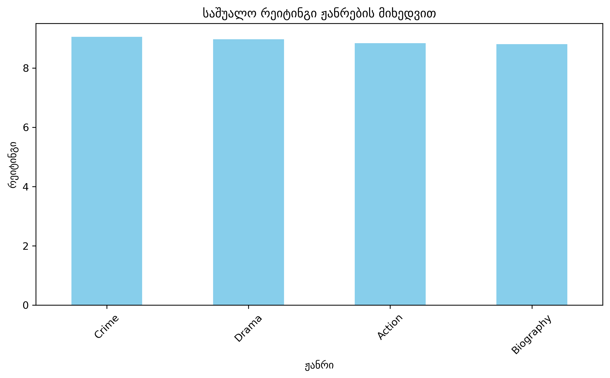
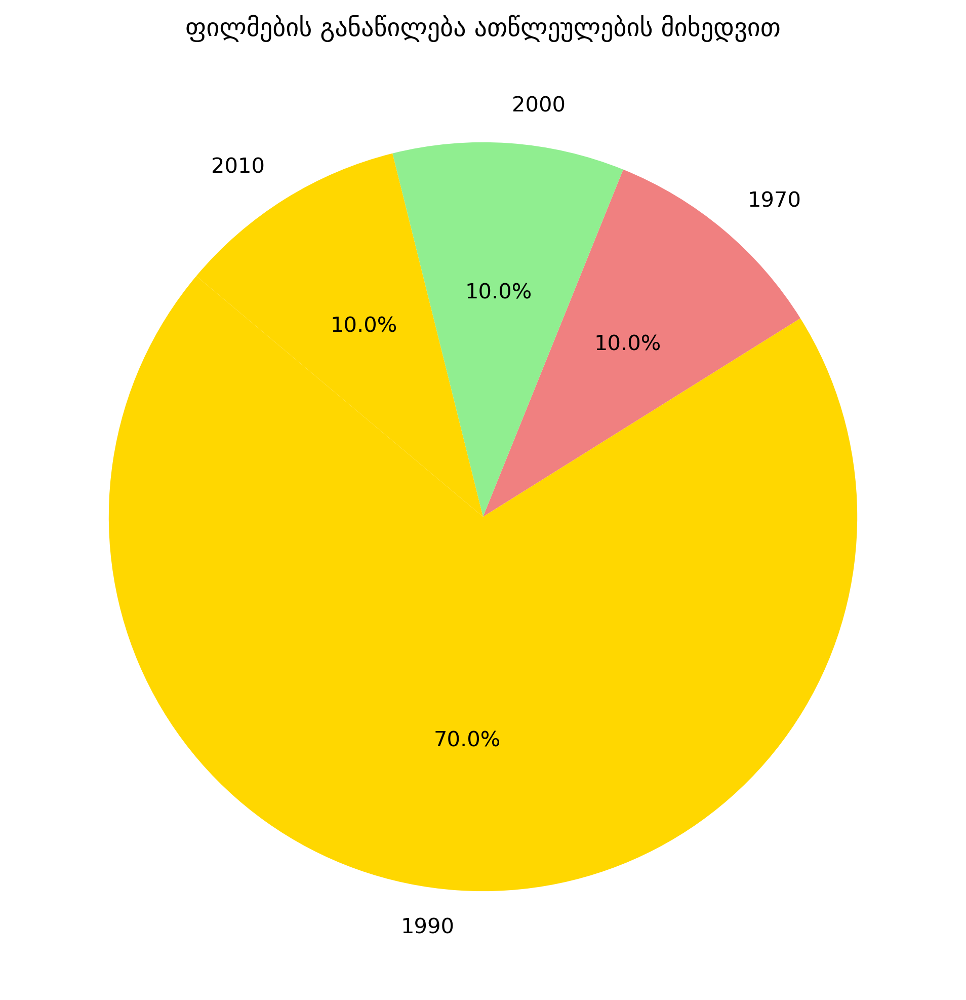

# ფინალური პროექტი: ფილმების მონაცემების ანალიზი

### პროექტის შესახებ:
ეს პროექტი აანალიზებს IMDB-ის ტოპ რეიტინგულ ფილმებს. თემა იმიტომ ავირჩიე, რომ საინტერესოა დავინახოთ კავშირი ჟანრებსა და რეიტინგებს შორის.

### ეტაპები:
1. **მონაცემების მოგროვება:** გამოვიყენე `pandas` ბიბლიოთეკა მონაცემთა ბაზის შესაქმნელად და CSV ფაილში შესანახად.
2. **დამუშავება:** გამოვიკვლიე საშუალო რეიტინგები ჟანრების მიხედვით და ფილმების განაწილება წლების მიხედვით.
3. **ვიზუალიზაცია:** გამოვიყენე `matplotlib` გრაფიკების შესაქმნელად.

### გამოყენებული ბიბლიოთეკები:
* Pandas
* Matplotlib

### ვიზულიზაცია

